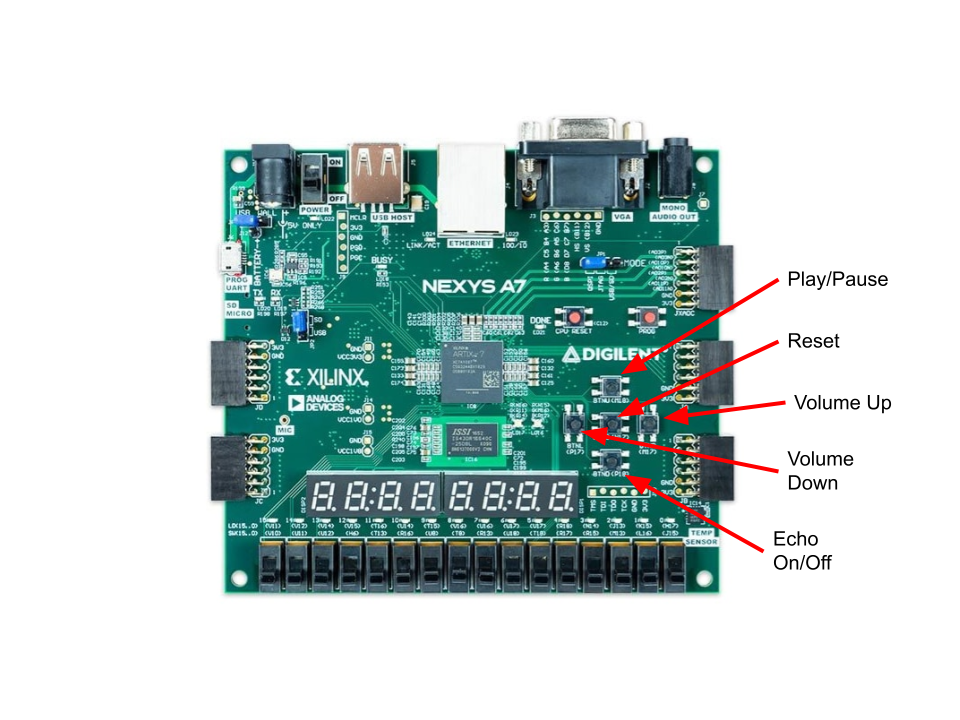

# CPE 487 Final Project: Karaoke Machine
### Danielle Bonk, Isabel Gringeri, William Hines
We created a karaoke machine that plays the notes to the children's nursery rhyme, 'Twinkle Twinkle Little Star'
The project will also display the lyrics on the screen via the VGA port

1. top level
2. tone generation
3. vga display
4. 

### Below is a guide for the function of each button on the board that operates the karaoke machine

### 1. Create a new RTL project TwinkleTwinkle in Vivado Quick Start
  - Create four new source files of file type VHDL called char_rom, text_display, top, twinkle_audio, twinkle_fsm and vga_synch

  - Create a new constraint file of file type XDC called const

  - Choose Nexys A7-100T board for the project

  - Click 'Finish'

  - Click design sources and copy the VHDL code from char_rom.vhd, text_display.vhd, top.vhd,        twinkle_audio.vhd, twinkle_fsm.vhd, vga_synch.vhd

  - Click constraints and copy the code from const.xdc

  - As an alternative, you can instead download files from Github and import them into your project when creating the project. The source file or files would still be imported during the Source step, and the          constraint file or files would still be imported during the Constraints step.

### 2. Run synthesis
### 3. Run implementation
### 4. Generate bitstream, open hardware manager, and program device
  - Click 'Generate Bitstream'

  - Click 'Open Hardware Manager' and click 'Open Target' then 'Auto Connect'

  - Click 'Program Device' then xc7a100t_0 to download top.bit to the Nexys A7-100T board

