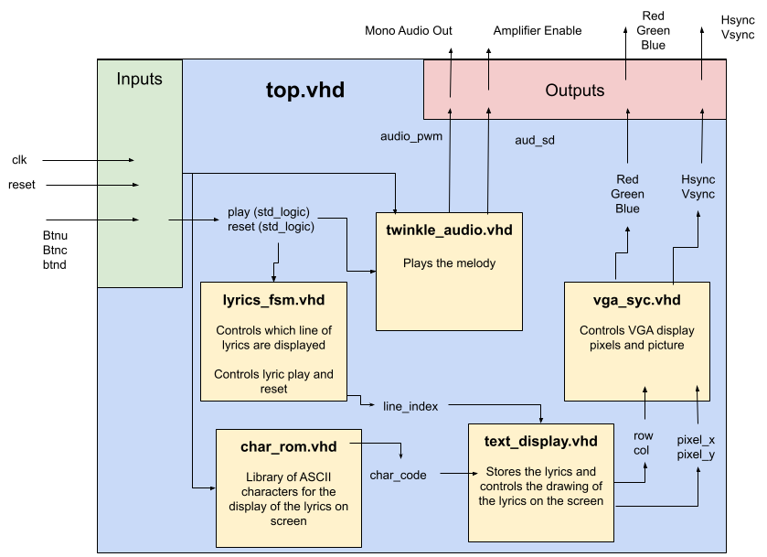

# CPE 487 Final Project: Karaoke Machine
### Danielle Bonk, Isabel Gringeri, William Hines

We created a karaoke machine that plays the notes to the children's nursery rhyme, **_Twinkle Twinkle Little Star_**.  
The project also displays the lyrics on screen via the VGA port in sync with the melody playback.

---

## System Overview

This project combines real-time **audio tone generation** and **VGA lyric display** using VHDL on a **Nexys A7-100T FPGA**. It integrates FSM control, character rendering from ROM, VGA signal timing, and a musical tone engine.

### Core Features
- VGA text output that scrolls lyrics in sync with the melody
- A tone generator module that plays the melody using square wave audio
- A finite state machine (FSM) that sequences notes and lyric transitions
- Support for reset/start controls using on-board buttons

### Required Attachments
- 3.5 mm audio jack output to speaker or headphones
- VGA monitor connected to the VGA output port on Nexys A7
- Nexys A7-100T board with proper constraint mappings

---

## Module Descriptions

### 1. `top.vhd` (Top-Level Module)
- Connects all submodules together (audio generation, VGA display, FSM).
- Takes input from the system clock and user control buttons.
- Routes VGA output (RGB, HSYNC, VSYNC) to physical VGA pins.
- Connects note and lyric state logic to both tone and text display modules.

---

### 2. `twinkle_audio.vhd` (Tone Generator)
- Produces a square wave audio tone using a pitch-controlled counter.
- Frequencies are determined using a lookup table mapped from note states.
- Uses basic digital audio synthesis with no DAC — audio output can be routed to PMOD or onboard speaker.
  
#### Tone Logic:
- A pitch value controls a timer counter.
- When the counter reaches the pitch value, it toggles the speaker output (square wave).
- For example, to play Middle C (261.63 Hz), we calculate a clock divider:
  - Assuming 100 MHz clock: `divider = 100e6 / (2 * 261.63) ≈ 191298`
- Outputs a digital waveform toggling at calculated pitch frequency.

---

### 3. `twinkle_fsm.vhd` (Finite State Machine)
- Drives the sequence of notes and associated lyric lines.
- Each state represents a duration of a single note.
- Transitions occur at fixed intervals using a tempo counter.
- Also emits the correct lyric index for VGA display.

#### FSM Structure:
- States are defined for each note in the melody.
- Output signals include:
  - `note_select` (index into pitch table)
  - `lyric_line` (index for VGA character ROM)
- State transitions are clocked based on tempo counter overflow.

---

### 4. `text_display.vhd` (Lyric VGA Output)
- Interfaces with VGA timing to render characters using `char_rom`.
- Converts character index and VGA row/column position into pixel color values.
- Supports a grid of 80x60 characters.

---

### 5. `char_rom.vhd` (Character ROM)
- Holds 8x8 pixel bitmaps for 128 ASCII characters.
- Each character is defined as 8 rows of 8-bit binary values.
- Indexed by ASCII value and scanline number (row within character cell).
- Example:
  - ASCII ‘A’ is stored as 8 rows of 0s and 1s describing the shape of the letter.

---

### 6. `vga_synch.vhd` (VGA Timing Generator)
- Generates standard 640x480 VGA timing signals.
- Outputs:
  - `hcount` and `vcount` for pixel position
  - `HSYNC` and `VSYNC` pulses
  - `video_on` flag for blanking areas outside visible region

#### VGA Resolution:
- 640 pixels (horizontal), 480 lines (vertical)
- Pixel clock = 25.175 MHz (approximated using a PLL or clock divider)
- Horizontal timing: 800 total cycles (640 visible)
- Vertical timing: 525 total lines (480 visible)

---

## Block Diagram

---

## Nexys A7 Board Inputs/Outputs

### Inputs:
| Signal        | Source    | Description                       |
|---------------|-----------|-----------------------------------|
| `btnC`        | Button C  | Play                              |
| `btnU`        | Button U  | Reset                             |
| `clk`         | 100 MHz   | System clock                      |

### Outputs:
| Signal       | Destination   | Description                      |
|--------------|---------------|----------------------------------|
| `vgaRed`     | VGA Port      | Red channel (4 bits)             |
| `vgaGreen`   | VGA Port      | Green channel (4 bits)           |
| `vgaBlue`    | VGA Port      | Blue channel (4 bits)            |
| `Hsync`      | VGA Port      | Horizontal sync                  |
| `Vsync`      | VGA Port      | Vertical sync                    |
| `audio_out`  | Pmod/speaker  | Audio signal (square wave)       |

### Karaoke Machine Button Guide  
The following diagram maps each button to its function:

---

## Modifications
To start this project, we did not start with base code from a lab. We went through the labs to see what would be helpful, like looking at the siren lab to see how we could pull in the square waves to help our development, but with the way that they were being called we saw that the only thing we could do was do our best to understand how the code was creating the waves and go from there. 

To start the process of creating the code, we consulted ai (claude and chatgpt) to see how the project could be started. While doing this we also searched online for any similar projects, which weren’t easy to find, and the only one that we could find was a [FPGA-MP3](https://github.com/evanfrazierc/FPGA-MP3-Player/blob/master/play_audio.v), which gave us the idea to try using importing youtube videos but that didn’t work.

Within our [Attempt1](./Attempt_1) module we used the base code that Claude provided to get a basic understanding of how this project should be built so that we could figure out how to parse together the different modules. This code was not functional at all, no sound, no vga, just theoretical code that we could look at and work from to see if we could get anything working. 
Once we reached this point we decided to roll back and go one at a time, the thought process being that if we start with getting the sound to work then work on vga then buttons, so within [Attempt2](./Attempt_2) we got some sound. Not perfect or remotely like Twinkle Twinkle Little Star, but from there we were able to find square wave frequencies that could then be converted to the correct notes of the song. At this point, we created a new top module so that we could combine the working sound and allow for it to be connected to the clock, the lyrics, characters, and vga sync. 
From there we were able to build upon the code we had, consult ai and look at the constraint files and past projects (specifically space invaders from Spring 2024) to help figure out how to work with the ascii characters. 
The small steps we took part by part to get this project working instead of big leaps were what our group was able to use so that we could get a deep understanding of how the code was working and ensure that we could figure out where our issues were.  

---

## Build Instructions
### 1. Create a new RTL project Twinkle Twinkle in Vivado Quick Start
  - Create four new source files of file type VHDL called char_rom, text_display, top, twinkle_audio, twinkle_fsm and vga_synch

  - Create a new constraint file of file type XDC called const

  - Choose Nexys A7-100T board for the project

  - Click 'Finish'

  - Click design sources and copy the VHDL code from char_rom.vhd, text_display.vhd, top.vhd,        twinkle_audio.vhd, twinkle_fsm.vhd, vga_synch.vhd

  - Click constraints and copy the code from const.xdc

  - As an alternative, you can instead download files from Github and import them into your project when creating the project. The source file or files would still be imported during the Source step, and the          constraint file or files would still be imported during the Constraints step.

### 2. Run synthesis
### 3. Run implementation
### 4. Generate bitstream, open hardware manager, and program device
  - Click 'Generate Bitstream'

  - Click 'Open Hardware Manager' and click 'Open Target' then 'Auto Connect'

  - Click 'Program Device' then xc7a100t_0 to download top.bit to the Nexys A7-100T board
### 5. Karaoke Machine Plays
  - Song and lyrics start automatically
    
  - Audio plays through speaker
    
  - VGA monitor shows lyrics synced to melody

---

## Images of Project in Action

### 1. Audio and VGA Display
The functioning audio and VGA display can be seen in the following: [Demo Video](https://youtube.com/shorts/Lp6_Z1P_TPM?feature=share)

### 2. Board Setup

---

## Challenges and Solutions

- **Character ROM Mapping Issues**: Characters initially displayed reversed due to bit-ordering mismatch — resolved by adjusting column indexing.
- **FSM Timing Sync**: Required careful tuning of FSM and VGA frame rate to ensure lyrics progressed correctly with audio.
- **VGA Repetition Bug**: Solved after refining row/column indexing and verifying line spacing logic.

---

## Future Additions 

### 1. Add a Microphone Input for Real Karaoke
- Use an ADC module (e.g. Pmod MIC3)
- Capture mic input and show real-time pitch analysis

### 2. Highlight Lyrics While Singing
- Add logic to change character color when its note is playing
- Modify `text_display` to support colored characters or underline mode

### 3. Add Multiple Songs
- Extend FSM and ROM to store multiple melody/lyric pairs
- Use buttons or switches to select the active song

### 4. Add Audio Filtering
- Implement basic low-pass filter for smoother tone
- Optionally upgrade from square wave to triangle or sine synthesis

---

## Contribution Breakdown
All group members contributed collaboratively to the design, implementation, and testing of the karaoke machine. During class sessions, we primarily worked together on Isabel's laptop, allowing us to collaboratively debug, write VHDL, and test functionality on the Nexys A7 board. During home work sessions, we met and worked on Will's PC, continuing development together.

## Timeline
Play "Twinkle Twinkle Little Star" via PWM square wave tone generation -> Display synchronized lyrics using VGA -> Interactive controls for starting and resetting the song
